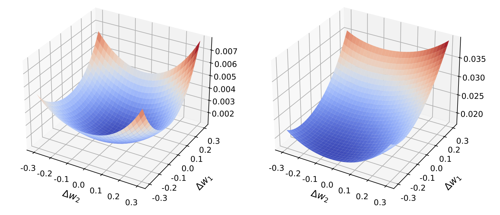
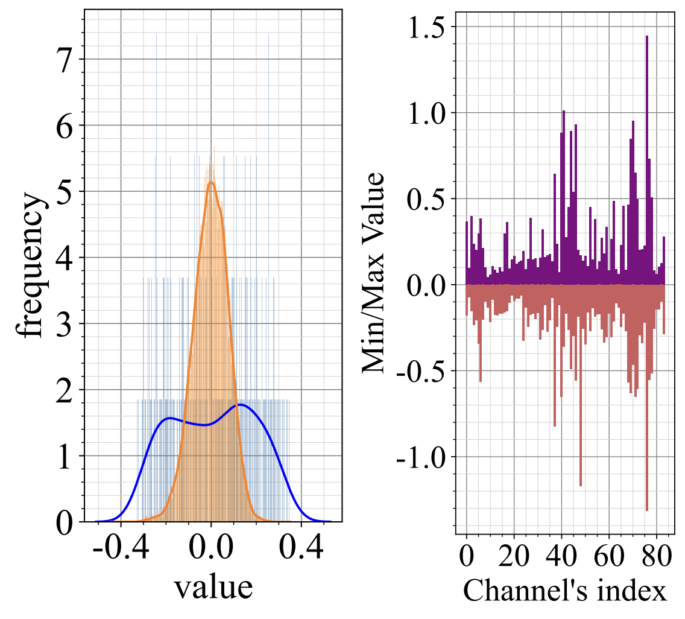
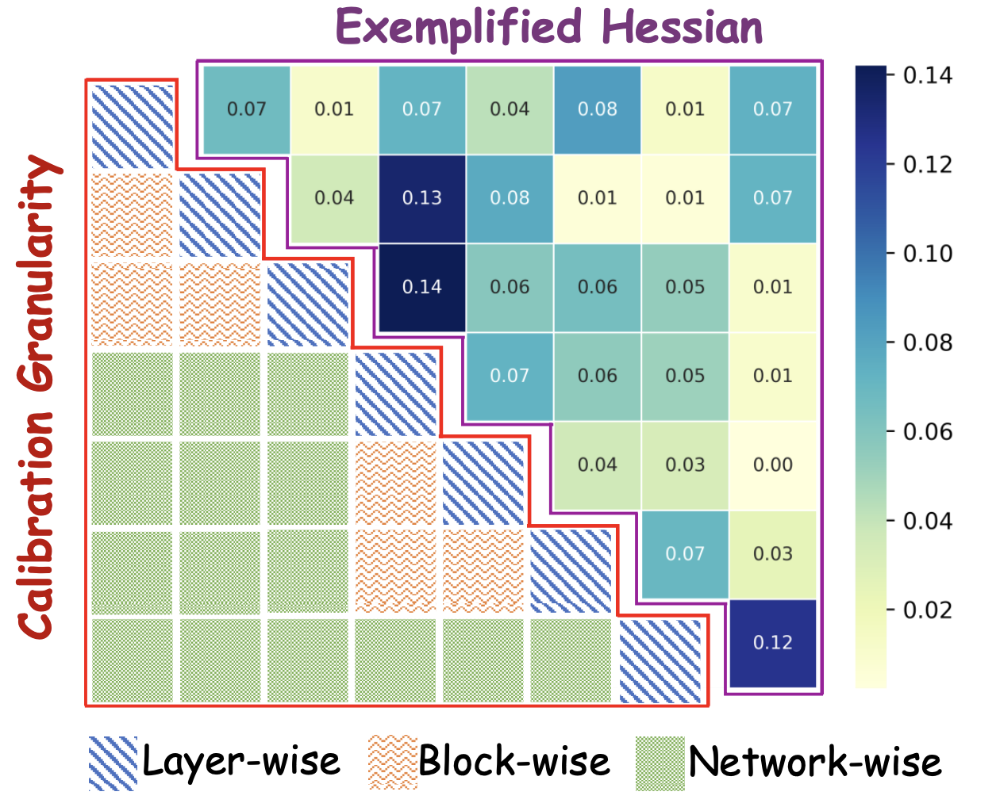

# 🚀 Analysis and Visualization

## 💡 Introduction
This tool is based on [loss-landscape](https://proceedings.neurips.cc/paper/2018/hash/a41b3bb3e6b050b6c9067c67f663b915-Abstract.html). Here, we provide a simple guide to perform analysis and visualization for video-INRs. For more details, please refer to [`loss-landscape-master/README.md`](loss-landscape-master/README.md).

Please modify `sys.path.append('/sjq/NeuroQuant/')` in the head of Python files to your local path.


## 1️⃣ Loss Landscape


The first time you run this, you need to execute the following script to generate the `.h5` file:

```bash
CUDA_VISIBLE_DEVICES=0 python draw/loss-landscape-master/plot_hnerv_surface.py  \
    --dir_type weights --xnorm filter --xignore biasbn --ynorm filter --yignore biasbn  --plot \
    --vmin 0.0005 --vmax 0.02 --vlevel 0.0005 --cuda --x=-0.2:0.2:31 --y=-0.2:0.2:31 \
    --arch hnerv --config draw/configs/HNeRV/Bunny_1280x640_3M.yaml \
    --data_path bunny --vid Bunny --b_w 4 --surf_file draw/visual_surface/layer0 --lid 0 \
    --weight results/HNeRV_Bunny_1280x640/Bunny_e300_b1_lr0.0005_l2/Encoder_0.31M_Decoder_2.65M_Total_2.66M/epoch300.pth
```

The results will be saved in the `draw/visual_surface` folder.


 - `--dir_type weights` indicates the direction has the same dimensions as the learned parameters, including bias and parameters in the BN layers.
 - `--xnorm filter` normalizes the random direction at the filter level. Here, a "filter" refers to the parameters that produce a single feature map.  For fully connected layers, a "filter" contains the weights that contribute to a single neuron.
 - `--xignore biasbn` ignores the direction corresponding to bias and BN parameters (fill the corresponding entries in the random vector with zeros).
 - `--vmin` and `--vmax` sets the range of values to be plotted.
 - `--vlevel` sets the step of the contours.
 - `--x=-0.2:0.2:31` sets the range and resolution for the plot.  The x-coordinates in the plot will run from -0.2 to 0.2 (the minimizers are located at 0 and 1), and the loss value will be evaluated at 31 locations along this line.
 - `b_w 4` sets the quantization bit-width to 4.
 - `lid 0` indicates the layer id to visualize.

Once the .h5 file is generated, you can draw the figure with:
```bash
python draw/loss-landscape-master/plot_2D.py  --vmin 0.0005 --vmax 0.02 --vlevel 0.0005 \
    --surf_file draw/visual_surface/layer0 --surf_name train_loss
```

## 2️⃣ Weight Statistics


Run the following script to generate weight distribution plots:
```
  CUDA_VISIBLE_DEVICES=0 python draw/draw_weight.py --arch hnerv --config configs/HNeRV/Bunny_1280x640_3M.yaml --weight results/HNeRV_Bunny_1280x640/Bunny_e300_b1_lr0.0005_l2/Encoder_0.31M_Decoder_2.65M_Total_2.66M/epoch300.pth
```

Results are saved in the `draw/visual_weight` folder.

## 3️⃣ Hessian Statistics

The Hessian represents the second derivative of the loss. After computing the Hessian values, you can use ***draw_hessian.ipynb*** to visualize them.
