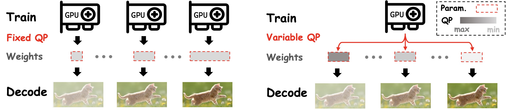

# ⚡️ NeuroQuant: On Quantizing Neural Representation for Variable-Rate Video Coding

### <div align="center">ICLR 2025 Spotlight</div>
<div align="center">
<a href="https://arxiv.org/abs/2502.11729"></a>
</div>




## 📑 Table of Contents

- [Installation](#🔧-installation)
- [Quick Start](#💻-quick-start)
  - [1️⃣ Train a FP32 Baseline](#1️⃣-train-a-fp32-baseline)
  - [2️⃣ Mixed-Precision Bit Allocation](#2️⃣-mixed-precision-bit-allocation)
  - [3️⃣ Network-Wise Calibration](#3️⃣-network-wise-calibration)
  - [4️⃣ Entropy Coding](#4️⃣-entropy-coding)
- [Toy Example](#🚗-toy-example)
- [More Evaluation](#🏃-more-evaluation)
- [Analysis and Visualization](#🚀-analysis-and-visualization)
- [BibTeX](#📖-bibtex)


## 🔧 Installation

- **Python:** >= 3.10  
- **PyTorch:** >= 1.11.0+cu11.3 ([Install Here](https://pytorch.org/))  
- **Path:** Modify `sys.path.append('/sjq/NeuroQuant/')` in the head of Python files to your local path.


## 💻 Quick Start

NeuroQuant is a ***post-training quantization framework***. Follow these steps to get started.


### 1️⃣ Train a FP32 Baseline

Since our method is applied post-training, you first need a ***full-precision (FP32) model*** as a baseline.


<details>
<summary>HNeRV-Bunny</summary>

```bash
CUDA_VISIBLE_DEVICES=0 python methods/regress.py  --data_path bunny --vid Bunny --arch hnerv  --outf HNeRV_Bunny_1280x640  --config configs/HNeRV/Bunny_1280x640_3M.yaml
```
</details>

<details>
<summary>NeRV-Bunny</summary>

```bash
CUDA_VISIBLE_DEVICES=0 python methods/regress.py  --data_path bunny --vid Bunny --arch nerv  --outf NeRV_Bunny_1280x640  --config configs/NeRV/Bunny_1280x640_3M.yaml
```
</details>

### 2️⃣ Mixed-Precision Bit Allocation
After obtaining the FP32 model, we perform layer-wise bit-width allocation to achieve mixed-precision quantization. Adjusting the total bit budget allows different rate-distortion trade-offs (see Section 3.1 in the paper).

- Define mixed-precision configurations for a given bit range.
- Select the optimal configuration using the proposed Omega sensitivity criterion.
- Optional: Integer Linear Programming or Genetic Algorithms can be applied using Omega as the scoring metric.

A toy example is provided in `methods/bit_assign.py`.

<details>
<summary>HNeRV-Bunny</summary>

```bash
CUDA_VISIBLE_DEVICES=0 python methods/bit_assign.py --data_path bunny  \
        --arch hnerv --vid Bunny --outf HNeRV_Bunny_1280x640 --config configs/HNeRV/Bunny_1280x640_3M.yaml \
        --batch_size 2 --channel_wise --init max  --mode omega \
        --ckpt results/HNeRV_Bunny_1280x640/Bunny_e300_b1_lr0.0005_l2/Encoder_0.31M_Decoder_2.65M_Total_2.66M/epoch300.pth
```
</details>


<details>
<summary>HNeRV-Bunny</summary>

```bash
CUDA_VISIBLE_DEVICES=0 python methods/bit_assign.py --data_path bunny  \
        --arch nerv --vid Bunny --outf NeRV_Bunny_1280x640 --config configs/NeRV/Bunny_1280x640_3M.yaml \
        --batch_size 2 --channel_wise --init max --mode omega \
        --ckpt results/NeRV_Bunny_1280x640/Bunny_e300_b1_lr0.0005_l2/Encoder_0.0M_Decoder_3.08M_Total_3.08M/epoch300.pth
```
</details>

### 3️⃣ Network-Wise Calibration

Once bit-widths are determined, calibrate the quantization parameters. Based on [AdaRound](https://arxiv.org/abs/2004.10568) and [BRECQ](https://arxiv.org/abs/2102.05426), we explore INR-centric strategies, including (see Section 3.2 in the paper):

- Channel-wise quantization

- Network-wise calibration

<details>
<summary>HNeRV-Bunny</summary>

```bash
CUDA_VISIBLE_DEVICES=0 python methods/calibrate_network.py --data_path bunny   \
        --arch hnerv --vid Bunny --outf HNeRV_Bunny_1280x640 --config configs/HNeRV/Bunny_1280x640_3M.yaml \
        --batch_size 2 --channel_wise --init max --opt_mode mse --input_prob 1.0 --norm_p 2.0 --iters_w 21000 \
        --hadamard --weight 0.01 --b_start 20 --b_end 2 --warmup 0.2 --lr 0.003 --precision 6 5 4 5 5 6 6 \
        --ckpt results/HNeRV_Bunny_1280x640/Bunny_e300_b1_lr0.0005_l2/Encoder_0.31M_Decoder_2.65M_Total_2.66M/epoch300.pth
```
</details>

<details>
<summary>NeRV-Bunny</summary>

```bash
CUDA_VISIBLE_DEVICES=0 python methods/calibrate_network.py --data_path bunny   \
        --arch nerv --vid Bunny --outf NeRV_Bunny_1280x640 --config configs/NeRV/Bunny_1280x640_3M.yaml \
        --batch_size 2 --channel_wise --init max --opt_mode mse --input_prob 1.0 --norm_p 2.0 --iters_w 21000 \
        --hadamard --weight 0.01 --b_start 20 --b_end 2 --warmup 0.2 --lr 0.003 --precision 6 5 4 5 5 6 6 \
        --ckpt results/NeRV_Bunny_1280x640/Bunny_e300_b1_lr0.0005_l2/Encoder_0.0M_Decoder_3.08M_Total_3.08M/epoch300.pth
```
</details>

> Note: Hadamard transform can increase runtime. Disable it with `--hadamard` or use `fast-hadamard-transform` in `quantization.quant_layer.py` for faster CUDA implementation.

### 4️⃣ Entropy Coding

Finally, the quantized model is encoded into a bitstream. Any entropy codec or entropy model can be used, so this step is implementation-agnostic.

# 🚗 Toy Example
Based on the scripts of above quaick start, we provide some ***training logs and sample results*** on [`results`](results) for reference. Due to remote access, the training time shown in the log will be longer than reported in paper. The corresponding model can be found in [Google Drive](https://drive.google.com/drive/folders/1tbTn16StR9CiQOZTY4k9JD0fqApBaEtI?usp=sharing). 

# 🏃 More Evaluation
Modify ***configs*** and ***hyperparameters*** to explore additional experiments and results.

# 🚀 Analysis and Visualization
Tools for analyzing INR characteristics are included, as described in the paper.
See [`draw/ReadMe.md`](draw/ReadMe.md) for details.


# 📖 BibTeX
```
@inproceedings{shiquantizing,
  title={On Quantizing Neural Representation for Variable-Rate Video Coding},
  author={Shi, Junqi and Chen, Zhujia and Li, Hanfei and Zhao, Qi and Lu, Ming and Chen, Tong and Ma, Zhan},
  booktitle={The Thirteenth International Conference on Learning Representations}
}

```
